# Arborescence simplifiee pour le site UTSEUS

## Navigation principale

```text
Accueil | Programme | Mobilite | Recherche & Projets | Ressources & Contact
```

## Structure simplifiee

```text
Accueil
├── Vue d'ensemble
├── Chiffres cles
├── Acces rapides
└── Actualites / mises en avant

Programme
├── Presentation UTSEUS
├── Cooperation sino-francaise
├── Partenaires
└── Chiffres cles

Mobilite
├── Etudiants UTC
├── Etudiants SHU
├── Parcours franco-chinois
└── Vie pratique

Recherche & Projets
├── ComplexCity
├── Axes de recherche
├── Projets franco-chinois
└── Fiches projets

Ressources & Contact
├── Brochure
├── Guide de mobilite
├── FAQ
├── Liens utiles
└── Contacts
```

## Schema Mermaid simplifie

```mermaid
flowchart TD
  A["Accueil"]

  A --> A1["Vue d'ensemble"]
  A --> A2["Chiffres cles"]
  A --> A3["Acces rapides"]
  A --> A4["Actualites / mises en avant"]

  A --> B["Programme"]
  B --> B1["Presentation UTSEUS"]
  B --> B2["Cooperation sino-francaise"]
  B --> B3["Partenaires"]
  B --> B4["Chiffres cles"]

  A --> C["Mobilite"]
  C --> C1["Etudiants UTC"]
  C --> C2["Etudiants SHU"]
  C --> C3["Parcours franco-chinois"]
  C --> C4["Vie pratique"]

  A --> D["Recherche & Projets"]
  D --> D1["ComplexCity"]
  D --> D2["Axes de recherche"]
  D --> D3["Projets franco-chinois"]
  D --> D4["Fiches projets"]

  A --> E["Ressources & Contact"]
  E --> E1["Brochure"]
  E --> E2["Guide de mobilite"]
  E --> E3["FAQ"]
  E --> E4["Liens utiles"]
  E --> E5["Contacts"]
```



## Menus deroulants proposes

```text
Programme
├── Presentation UTSEUS
├── Cooperation sino-francaise
├── Partenaires
└── Chiffres cles

Mobilite
├── Etudiants UTC
├── Etudiants SHU
├── Parcours franco-chinois
└── Vie pratique

Recherche & Projets
├── ComplexCity
├── Axes de recherche
├── Projets franco-chinois
└── Fiches projets

Ressources & Contact
├── Brochure
├── Guide de mobilite
├── FAQ
├── Liens utiles
└── Contacts
```

## Justification pour le rapport

Cette arborescence volontairement simplifiee permet de conserver cinq entrees principales facilement memorisables. Chaque entree regroupe uniquement les pages essentielles, ce qui rend la navigation plus lisible et mieux adaptee a un public international.
